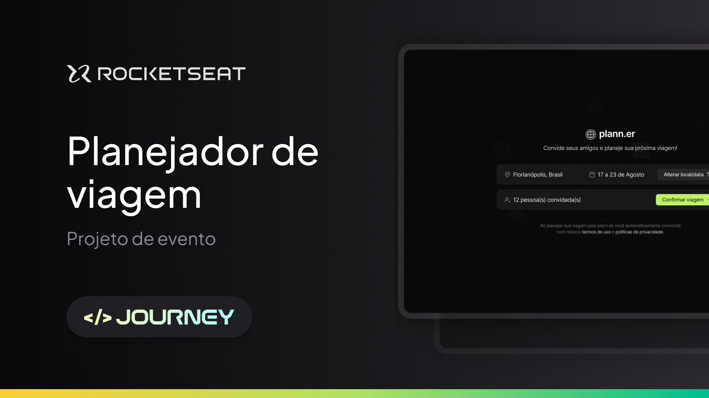

# Planejador de Viagem ✈️



<br>

## Índice 💡

- [Descrição](#descrição)
- [Funcionalidades](#funcionalidades)
- [Instalação](#instalação)
- [Como Usar](#como-usar)
- [Tecnologias Utilizadas](#tecnologias-utilizadas)


## Descrição 

O Planejador de Viagem é uma aplicação web desenvolvida para facilitar a organização de viagens em grupo. Com esta ferramenta, você pode convidar amigos, definir destinos, escolher datas e gerenciar a logística de suas viagens de forma simples e eficiente.\
Esse projeto foi realizado durante a Next Level Week Journey, em julho de 2024, oferecido pela instituição de ensino [Rocketseat](https://app.rocketseat.com.br/)  


## Funcionalidades

- Criação de eventos de viagem com destino e datas.
- Gerenciamento de participantes.
- Confirmação de viagem.
- Alteração de local e datas conforme necessário.
- Visualização das informações da viagem em uma interface amigável.


## Instalação 📲

1. Clone o repositório:
    ```bash
    git clone https://github.com/RosoIsabela/NLW-journey-reactJS.git
    ```
2. Navegue até o diretório do projeto:
    ```bash
    cd NLW-journey-reactJS
    ```
3. Instale as dependências:
    ```bash
    npm install
    ```
4. Inicie a aplicação:
    ```bash
    npm run dev
    ```


## Como Usar

1. Abra a aplicação em seu navegador:
    ```bash
    http://localhost:3000
    ```

2. Crie um novo evento de viagem fornecendo as informações necessárias
    > ⚠️**Observação**:
    > Não é possível selecionar dias anteriores à data atual
 

3. Convide seus amigos para participar da viagem.

4. Tenha uma ótima e organizada viagem 


## Tecnologias Utilizadas

- **FrontEnd:** ReactJs, HTML, CSS, Tailiwind
- **BackEnd:** NodeJS

